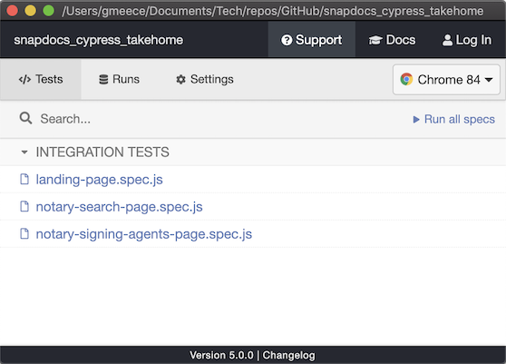

# README for Cypress Exercise Prompt

## Background

| Candidate  | E-Mail            | LinkedIn                               | GitHub Link                                          |
| ---------- | ----------------- | -------------------------------------- | ---------------------------------------------------- |
| Greg Meece | glmeece@gmail.com | https://www.linkedin.com/in/gregmeece/ | https://github.com/GLMeece/snapdocs_cypress_takehome |

## Challenge

The following is a transcription of the challenge as stated via email:

> **Cypress Exercise Prompt:** 
> Please install Cypress and create an automated test of the [snapdocs.com](https://snapdocs.com/) website:
> 1. Verify elements on the landing page you feel should be verified.
> 2. Navigate to the Notary Signing Agents page and include expectations/assertions to verify items you feel are important to verify.
> 3. Search for a notary by zip code:
>    1. A list of notaries and their information should appear. 
>    2. Verify results are returned. 
>    3. Verify the contents of a notary panel of your choosing.
> 4. *Bonus*: create an alias and use it in the spec.
> **Note**:
> - If you are going to be using GitHub to complete your exercise, please make sure the repository is private and download into a zip drive [_sic_].
> - Please send finished exercise to Max ([maximo.gurfinkel](http://maximo.gurfinkel/)@[snapdocs.com](http://snapdocs.com/)) and myself ([toni.neri](http://toni.neri/)@[snapdocs.com](http://snapdocs.com/)) and make it shareable with the following team members:
>   * Patrick Francis - [patrick.francis@snapdocs.com](mailto:patrick.francis@snapdocs.com) 
>   * Cristian Brotto - [cris@snapdocs.com](mailto:cris@snapdocs.com) 
>   * Matt Middlesworth - [matt.middlesworth@snapdocs.com](mailto:matt.middlesworth@snapdocs.com)


## Installation, Execution, Running Test Cases

To run the author's solution, you must first clone the repository and then install Cypress (if it is not already). 

_Presuppositions_: 

* Presumably, the user will be acquainted with [Cypress](https://www.cypress.io/). If not, a quick video overview may be helpful:
  [](https://player.vimeo.com/video/237527670?title=0&byline=0&portrait=0 "What is Cypress?")
* It is assumed the user already has both [**Git**](https://git-scm.com/book/en/v2/Getting-Started-Installing-Git) and [**NPM**](https://www.npmjs.com/get-npm) (Node Package Manager) installed. If either of those are not installed, this exercise is left to the user and the search engine of their choice.
* It is further assumed that the user is familiar with a terminal on the platform of their choice.

### Installation & Execution of Cypress

1. Change directories to the location of one's choice (e.g., `c:\my_repos` or `~/Documents/my_repos`) and clone this repository: 
   `git clone git@github.com:GLMeece/snapdocs_cypress_takehome.git`
2. In a terminal, install Cypress: `npm install cypress`
3. Once installed, run the dashboard: `npx cypress open`
  You will see a dashboard appear:
  
4. Click on the **Run all specs** link.
5. The tests will execute, there will be fun stuff on the screen, and there will be great rejoicing.


## Test Case Execution

The following are my notes and commentary on how I addressed the exercise prompt, referencing the numbers as quoted above. There are additional thoughts and comments in the [Design Notes](#design-notes) section below.

---

>  1) Verify elements on the landing page you feel should be verified.

The landing page has a high degree of complexity. For the scope of this exercise, it would not be possible to explore all the elements and features present here. So, as a representative smoke tests, the test cases click on links to other segments of the website. These cases are divided by:

* Top links
* Body links

For the top links (Lenders, Title / Escrow, Notary Signing Agents, Resource Center, COVID-19 Guide, Sign In, Get Started), each is clicked and it is verified that the URL conforms to the expected location on the site.

For the body links (in the **Explore the Snapdocs digital closing platform** section), the _Learn more →_ links are clicked, again verifying that the correct URL is reached.

There is obviously significantly more that _should_ be done to verify the home page, but this smoke test subset is just a representative.

Additionally, upon landing, the Cookies prompt is accepted.

---

> 2) Navigate to the Notary Signing Agents page and include expectations/assertions to verify items you feel are important to verify.

asdfasdf

---

> 3) Search for a notary by zip code:
>   1. A list of notaries and their information should appear. 
>   2. Verify results are returned. 
>   3. Verify the contents of a notary panel of your choosing.

`cypress/integration/notary-search-page.spec.js` 

---


> 4) *Bonus*: create an alias and use it in the spec.

This was addressed in the `cypress/integration/notary-signing-agents-page.spec.js` test file. Here is the relevant section:

```javascript
describe('Perfect Closing Signup page', () => {
  beforeEach(() => {
    cy.visit('more-info/?identity=Notary')
    acceptCookies()
    cy.get('#lender + label').as('lenderButton')
    cy.get('#title-escrow + label').as('titleEscrowButton')
    cy.get('#signing-service + label').as('signingServiceButton')
    cy.get('#notary + label').as('notaryButton')
  })
```

## Design Notes

The following indicates some of the design decisions I made and some of the issues I encountered. These notes are not organized by their level of signficance, so you will see varying levels of per

A few random notes up front

I've seen both `describe` and `context` used with Mocha-related examples, but [apparently they are the same thing](https://lmws.net/describe-vs-context-in-rspec), with **describe** being somewhat preferred.

## Selector Approach

To the extent I could, I followed the basic CSS hierarchy of preferred selectors (ids, class, tags, attributes, etc.). I could not [per the recommendation of the Cypress team](https://docs.cypress.io/guides/references/best-practices.html#Selecting-Elements), utilize the [custom Cypress tags mentioned promoted in the documents](https://docs.cypress.io/guides/core-concepts/test-runner.html#Selector-Playground). However, whenever it made sense, I favored leveraging the selector presented by the Selector Playground widget in the app pane of the runner window. 

However, I discovered some things in the HTML which gave me pause in using the IDs as they were. For example, the **Get Started** button has an ID of `menu-item-730` which seems decidedly non-semantic. Not knowing the development and build process, I have no idea whether or not this ID string is fixed for eternity, or whether the numeric portion (i.e., `730`) will change upon the next incremented release. Because of this (my lack of assurance as to the stability of the ID):

```javascript
// Instead of this:
cy.get('#menu-item-730 > a').click()
// I chose this pattern:
cy.get('a').contains('Get Started').click()
```


### Page Objects vs. App Actions

[Page Objects](https://martinfowler.com/bliki/PageObject.html) are [a well-established pattern for testing with Selenium](https://github.com/SeleniumHQ/selenium/wiki/PageObjects). However, [Cypress isn't Selenium](https://docs.cypress.io/faq/questions/general-questions-faq.html#Does-Cypress-use-Selenium-Webdriver), and it encourages (and sometimes enforces) different paradigms. One of the paradigms it encourages is moving away from the Page Object patterns. The main objections to this design pattern can be found in the article [**Stop using Page Objects and Start using App Actions**](https://www.cypress.io/blog/2019/01/03/stop-using-page-objects-and-start-using-app-actions/#page-objects-problems).

Having pondered the author's points, reading [an article](https://medium.com/reactbrasil/deep-diving-pageobject-pattern-and-using-it-with-cypress-e60b9d7d0d91) and watching [a video tutorial](https://testautomationu.applitools.com/cypress-tutorial/chapter7.html) on using Page Objects with Cypress, and considering my experience with this pattern, I've elected to instead lean into this tried and true approach. Perhaps with more time and experience, I'll begin drinking this kool-aid and move towards the App Actions pattern instead. For now, Page Objects is my approach of choice.